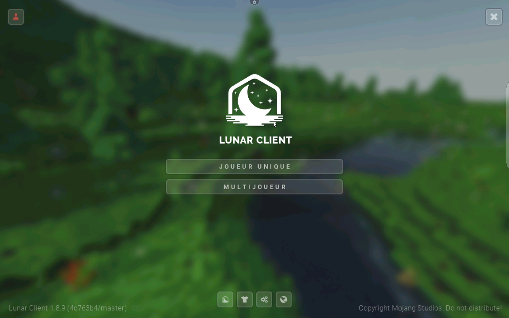
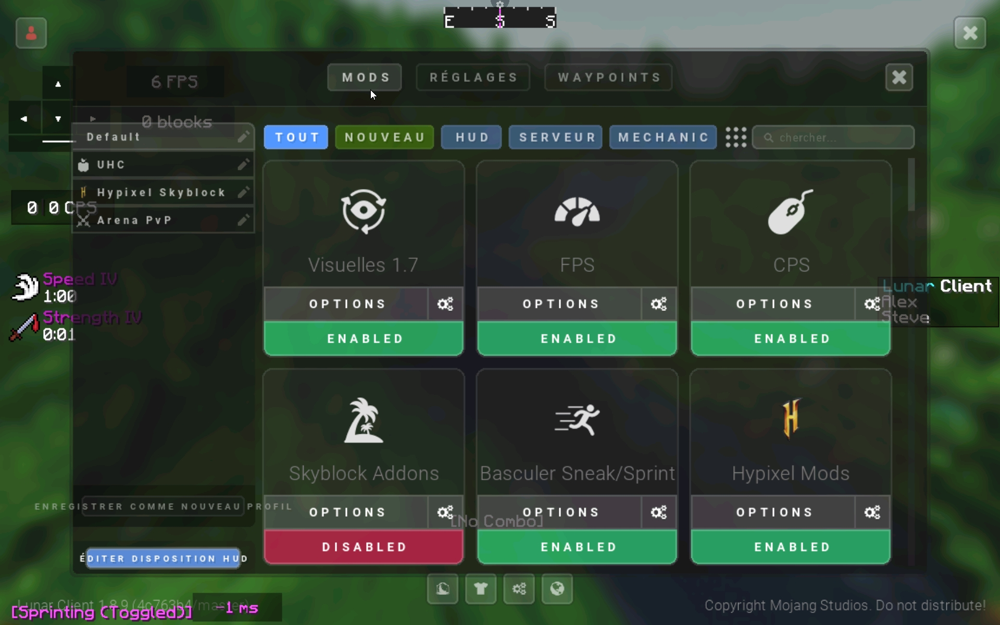

# DISCLAMER

THIS IS IN **DEVELOPEMENT**

# Lunar-Client-new-
Lunar Client is a PvP Client 

# Update

Adding Texture

Made Nametags works

# Credit
Cracked by PrimeTDMomega
(i copied the description yes so gives support to him)
[Withered Knights](https://dsc.gg/witheredknights)
And Modify By Doyoda
# SCREENSHOT

as you can see i changed menu paranoma

# Step one

Download LC.zip

# Step Two

Extract

# Step three

1. Open the `%appdata%` directory 
 2. Open the folder named `.minecraft`
 3. Open folder named `versions`
 4. Copy-Paste/Cut-Paste/Drag-n-Drop/ the extracted file into this `versions` folder
 5. Open intended Minecraft Launcher and select the the instance named `LC`

# Multiplayer

just press singleplayer

choose a word
esc
then multiplayer

DISCLAMER(I wil make multiplayer work)
